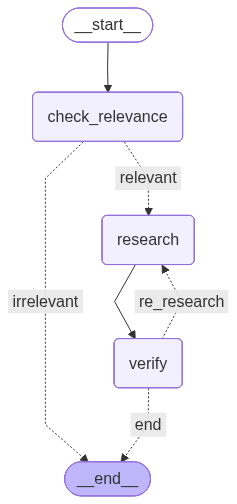

# Docling - AI Document Processing System

A sophisticated document processing system that uses AI agents to analyze, retrieve, and answer questions from PDF documents. Learning about AI document processing and how to build a document processing system. Workflow is based on LangGraph and LangChain.

## Features

- 🤖 **Multi-Agent Workflow**: Research, verification, and relevance checking agents
- 📄 **PDF Processing**: Advanced document loading and text splitting
- 🔍 **Hybrid Retrieval**: Combines BM25 and vector-based search
- 🧠 **AI-Powered**: Uses Claude for intelligent document analysis
- 📊 **Workflow Visualization**: Mermaid diagrams for workflow understanding
## Workflow Diagram



*Generated using Mermaid - see `src/utils/draw_workflow.py` for details*

## Architecture

### Components

- **ResearchAgent**: Generates answers from document context
- **VerificationAgent**: Validates answer accuracy against sources
- **RelevanceChecker**: Determines if documents can answer the question
- **HybridRetriever**: Combines multiple retrieval strategies

## Installation

1. Clone the repository:
```bash
git clone <repository-url>
cd Docling
```

2. Create virtual environment:
```bash
python -m venv .venv
source .venv/bin/activate  # On Windows: .venv\Scripts\activate
```

3. Install dependencies:
```bash
pip install -e .
```

## Configuration

Create a `.env` file with your API keys:

```env
ANTHROPIC_API_KEY=your_anthropic_api_key_here
TEMPERATURE=0.7
MAX_NEW_TOKENS=1024
HYBRID_RETRIEVER_WEIGHTS=[0.5, 0.5]
CHROMA_DB_PATH=chromadb
```

## Usage

### Basic Usage

```python
from src.services.file_handler import FileHandler
from src.core.retriever import Retriever
from src.agents.workflow import AgentWorkflow

# Load and process documents
file_handler = FileHandler()
chunks = file_handler.get_file_chunks("document.pdf", 200, 20)

# Create retriever
retriever = Retriever()
hybrid_retriever = retriever.build_hybrid_retriever(chunks)

# Run workflow
workflow = AgentWorkflow()
result = workflow.full_pipeline("What is the company's revenue?", hybrid_retriever)
print(result["draft_answer"])
```

### Workflow Visualization

```python
# Generate workflow diagram
workflow = AgentWorkflow()
workflow.draw_workflow()
```

## Project Structure

```
Docling/
├── src/
│   ├── agents/           # AI agents
│   │   ├── research_agent.py
│   │   ├── verification_agent.py
│   │   ├── relevance_checker.py
│   │   └── workflow.py
│   ├── core/             # Core functionality
│   │   ├── retriever.py
│   │   ├── llm_client.py
│   │   └── embedding.py
│   ├── services/         # Service layer
│   │   └── file_handler.py
│   └── config/           # Configuration
│       └── settings.py
├── example/              # Sample documents
├── tests/                # Test suite
└── main.py              # Main entry point
```

## Workflow Process

1. **Relevance Check**: Determines if documents contain relevant information
2. **Research**: Generates answer using retrieved context
3. **Verification**: Validates answer accuracy against sources
4. **Iteration**: Re-researches if verification fails

## Dependencies

- `langchain`: LLM framework
- `langchain-anthropic`: Claude integration
- `chromadb`: Vector database
- `sentence-transformers`: Text embeddings
- `pypdf`: PDF processing
- `langgraph`: Workflow orchestration

## Development

### Running Tests

```bash
pytest tests/
```

### Code Formatting

```bash
black src/
ruff check src/
```

## Contributing

1. Fork the repository
2. Create a feature branch
3. Make your changes
4. Add tests
5. Submit a pull request

## License

MIT License - see LICENSE file for details.
